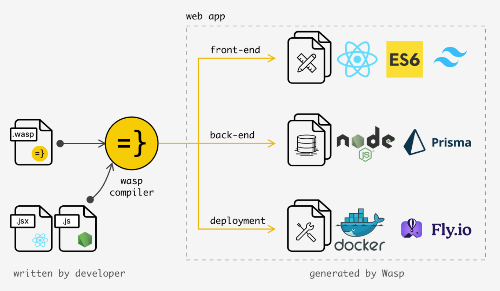

To run locally:
 
1. clone or download repo
2. install Wasp CLI: curl -sSL https://get.wasp-lang.dev/installer.sh | sh
3. Position into the unzipped dir and run the app:
4. cd <app-name>
5. wasp db migrate-dev # init the db
6. wasp start

If you are running on windows, download and set up WSL for linux subsystem on windwos and install node.js 18

Valid. is a mental wellness web app designed specifically for college students to manage their mental health through a friendly, clean, and supportive online environment. The app will consist of several key pages, each with a distinct purpose and set of functionalities to provide an engaging and helpful user experience. 

Landing Page:
The landing page will be the welcoming interface of “Valid.”, designed to be warm and inviting. 
It should feature calming colors and minimalist design to promote a sense of peace. 
Key elements will include a brief introduction to the app's purpose, testimonials from users, and clear navigation to sign-up or sign-in pages. 
The page will also have a live chat support option for immediate assistance. 

Sign-Up / Sign-In Page: 
A straightforward and secure sign-up/sign-in page for new and returning users. 
The sign-up process will collect minimal information to reduce barriers to entry, focusing on email, password, and a consent checkbox for privacy policy and terms of use. 
After sign-in, users will be directed to their personalized dashboard. 

User Dashboard: 
The dashboard will serve as the central hub for users after they sign in. 
It will display daily mental wellness "to-dos'' such as mindfulness exercises, breathing techniques, and short meditations. 
Users will receive daily affirmations or positive facts to encourage a positive mindset.
The dashboard will also include a progress tracker for users to monitor their mental wellness journey. 

Resources Page: 
This page will offer a curated list of mental wellness resources, including articles, podcasts, and videos.
It will be categorized by topics such as stress management, coping with anxiety, and building resilience. 
Users can save their favorite resources to their profile for easy access. 

Personal Journal Page: 
Users will have a private space to journal their thoughts, feelings, and experiences.
The journal will have optional prompts to guide users in reflective writing. 
Users can set reminders for regular journaling and review past entries. 

Settings/Profile Page: 
Users can customize their experience by setting preferences for notifications, privacy, and account details. 
The profile section will allow users to update their personal information and change their password. 

Database Requirements: 
User accounts information (email, password, user preferences). 
Daily mental wellness "to-dos" and progress tracking data. 
Saved resources and journal entries for each user.

